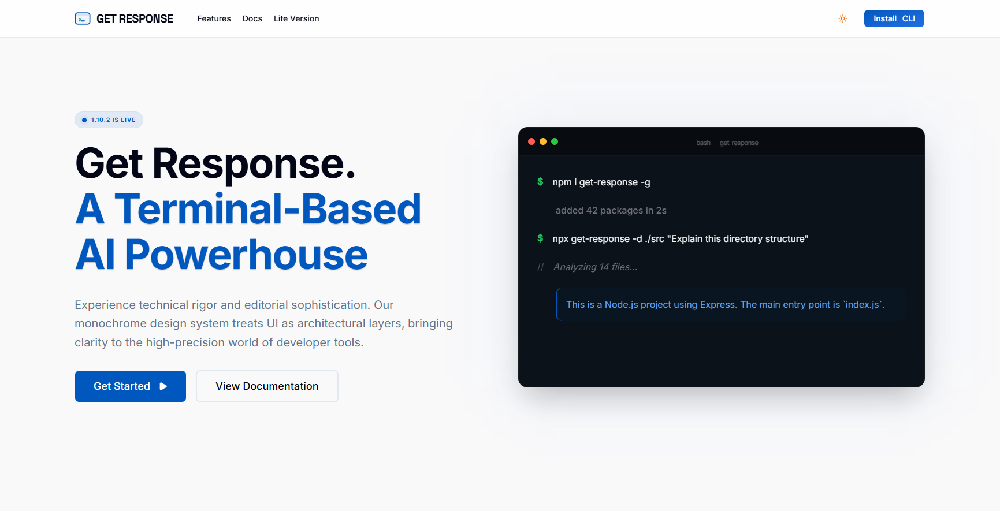

# Get Response — A Terminal-Based AI Powerhouse



Experience technical rigor and editorial sophistication. **Get Response** is a high-precision AI tool designed for developer workflows, treating the terminal as an architectural layer for direct, context-aware interaction with your codebase.

## 🚀 Key Features

- **Gemini Integration**: Near-instant responses powered by Google's Gemini Pro, engineered for low-latency conversational interactions.
- **Context-Aware**: Understands your environment. Interact naturally with files and folders in your current directory without manual context switching.
- **Terminal Automation**: Describe tasks in plain English (e.g., "Refactor this script") and get exact shell commands or code changes.
- **Visual Intelligence**: Generate Mermaid.js diagrams mapping out class structures or data flows directly from your terminal output.
- **Rich Design System**: A monochrome, high-contrast aesthetic that brings clarity to high-precision developer tools.

## 📦 Installation

Install globally via NPM:

```bash
npm i get-response -g
```

## 🛠️ Usage

Analyze your current project structure:

```bash
npx get-response -d ./src "Explain this directory structure"
```

Refactor code on the fly:

```bash
npx get-response "Refactor this python script for better performance"
```

## ⚡ Get Response Lite

Looking for something lighter? Meet `get-response-lite`.

A streamlined, high-performance alternative designed for CI/CD pipelines or constrained environments.

- **80% Smaller Footprint**: Minimal dependencies for maximum speed.
- **Pure AI Engine**: Retains all conversational capabilities while omitting heavy features like OCR or PDF parsing.
- **Fast Installation**: Installs in seconds.

```bash
npm install get-response-lite -g
```

## 🛠️ Development

This is a [Next.js](https://nextjs.org) project.

```bash
pnpm dev
```

Open [http://localhost:3000](http://localhost:3000) to see the landing page.

